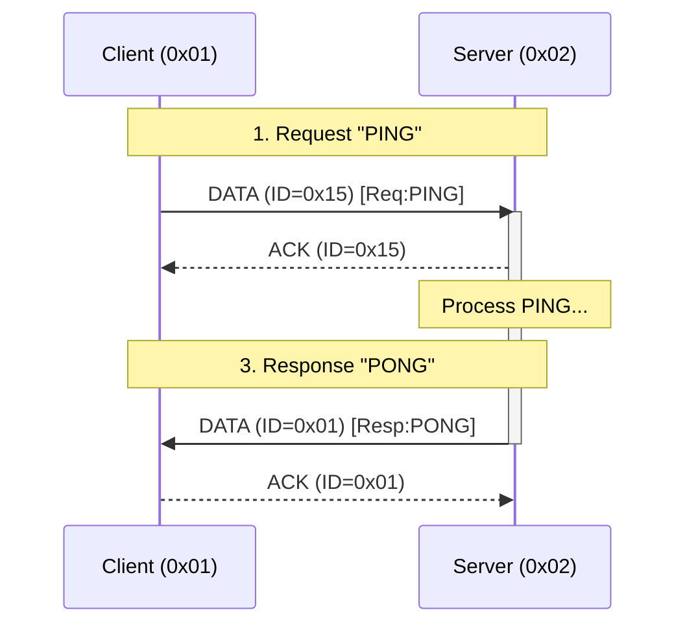

# Appendix A: Example Transaction

**Scenario**: Client (Addr `0x01`) sends "PING" to Server (Addr `0x02`) on Service `0x01`.
**Config**: `PHYS_MTU=32`, `L2=CRC16`, `L5=Enabled`.



## 1. Request (Client -> Server)
*   **L3**: Src=`0x01`, Dst=`0x02`
*   **L5**: Type=`DATA` (00), ID=`0x15` (Random start) -> Byte `0x15`
*   **L6**: Index=`0`, Control=`IsLast` (0x01) -> Bytes `00 01`
*   **L8**: Service=`0x01`, Stateful=`0` -> Byte `0x02` (00000010)
*   **Payload**: "PING" -> `50 49 4E 47`

**Packet Hex Dump (12 bytes total):**
```
01 02       (L3 Header)
15          (L5 Header)
00 01       (L6 Header)
02          (L8 Header - Stateless)
50 49 4E 47 (Payload "PING")
A1 B2       (L2 CRC16 - Example)
```

## 2. ACK (Server -> Client)
Server acknowledges the L5 packet immediately.
*   **L3**: Src=`0x02`, Dst=`0x01`
*   **L5**: Type=`ACK` (01), ID=`0x15` -> Byte `0x55` (01010101)
*   **L6/L8**: (Transparent/None)

**Packet Hex Dump (5 bytes total):**
```
02 01       (L3 Header)
55          (L5 Header - ACK 0x15)
C3 D4       (L2 CRC16 - Example)
```

## 3. Response (Server -> Client)
Server application processes "PING" and returns "PONG".
*   **L3**: Src=`0x02`, Dst=`0x01`
*   **L5**: Type=`DATA` (00), ID=`0x01` (Server's own sequence start)
*   **L6**: Index=`0`, Control=`IsLast` (0x01)
*   **L8**: Service=`0x01`, Stateful=`0` -> Byte `0x02`
*   **Payload**: `0x00` (Status: OK) + "PONG" -> `00 50 4F 4E 47`

**Packet Hex Dump (13 bytes total):**
```
02 01          (L3 Header)
01             (L5 Header)
00 01          (L6 Header)
02             (L8 Header - Stateless)
00 50 4F 4E 47 (Status OK + Payload "PONG")
E5 F6          (L2 CRC16 - Example)
```