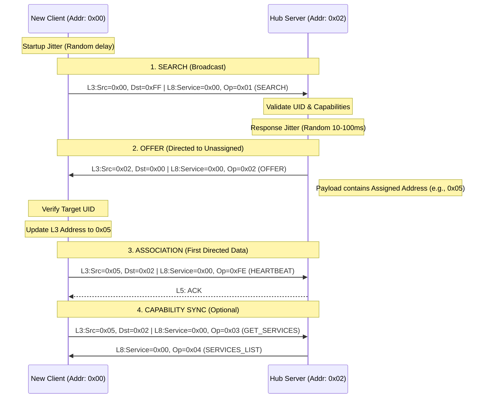

# Appendix C: Service Discovery & Broadcast Handshake

This appendix provides a visual and technical breakdown of the **microcomm** discovery process. It illustrates how a new node transitions from an unassigned state (`0x00`) to a fully associated network member.

## The Discovery Sequence

The following diagram illustrates the interaction between a new **Client** (e.g., a sensor) and a **Server** (e.g., a Hub).

## Key Transitions

### 1. The Broadcast Phase (L3: 0xFF / 0x00)
*   **Search**: The client uses `0xFF` as the destination. Every node hears this, but only a Server (Hub) processes Service `0x00`.
*   **Offer**: The server responds to `0x00`. Since multiple nodes might be searching, the server includes the **Client's UID** in the payload. Every searching node reads the packet, but only the one with the matching UID accepts the `Assigned Address`.
*   **Reliability**: Layer 5 ACKs are **DISABLED** during this phase to prevent radio collisions.

### 2. The Directed Phase (L3: Assigned Address)
*   Once the client receives its `Assigned Address` (e.g., `0x05`), it reconfigures its **Layer 1 Driver** (e.g., updating nRF24 Pipe 0).
*   All subsequent communication uses the Assigned Address.
*   **Reliability**: Layer 5 ACKs are now **ENABLED**, ensuring reliable command delivery.

## Anti-Collision Mechanisms
*   **Startup Jitter**: Prevents a "Thundering Herd" if multiple sensors are powered on simultaneously (e.g., after a power outage).
*   **Response Jitter**: If multiple Hubs exist, this prevents their `OFFER` packets from colliding in the air.
*   **Target UID Echo**: Acts as a software-level filter to ensure the `OFFER` is only acted upon by the correct physical device.
