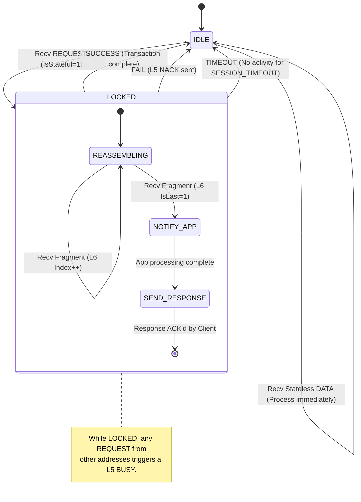

# Appendix D: Session State Machine

This appendix defines the lifecycle of a **microcomm** session. Implementing this state machine ensures that the server (node) correctly manages client locks, prevents memory leaks during fragmentation, and recovers gracefully from communication failures.

## Server-Side Session State

The server follows a "Single Active Session" model. It locks itself to a specific Client Address until the transaction is complete or a timeout occurs.

## State Definitions

| State | Description |
| :--- | :--- |
| **IDLE** | The default state. The node listens for any incoming packet. |
| **LOCKED** | The node has accepted a stateful session. The `Session_Client_Addr` is stored. |
| **REASSEMBLING** | The node is collecting L6 fragments into the `Max_Buffer`. |
| **NOTIFY_APP** | The full message is available. The L8 Service handler is invoked. |
| **SEND_RESPONSE** | The node is transmitting the result back to the client. |
| **TIMEOUT** | A safety transition. If the client stops talking mid-session, the node resets to IDLE. |

## Implementation Notes
*   **Buffer Safety**: Upon transitioning to `IDLE` (regardless of success or failure), the `Max_Buffer` and L6 `Expected_Index` **MUST** be zeroed/reset.
*   **Watchdog**: The `SESSION_TIMEOUT` timer (usually 100ms–500ms) should be checked every loop cycle.
