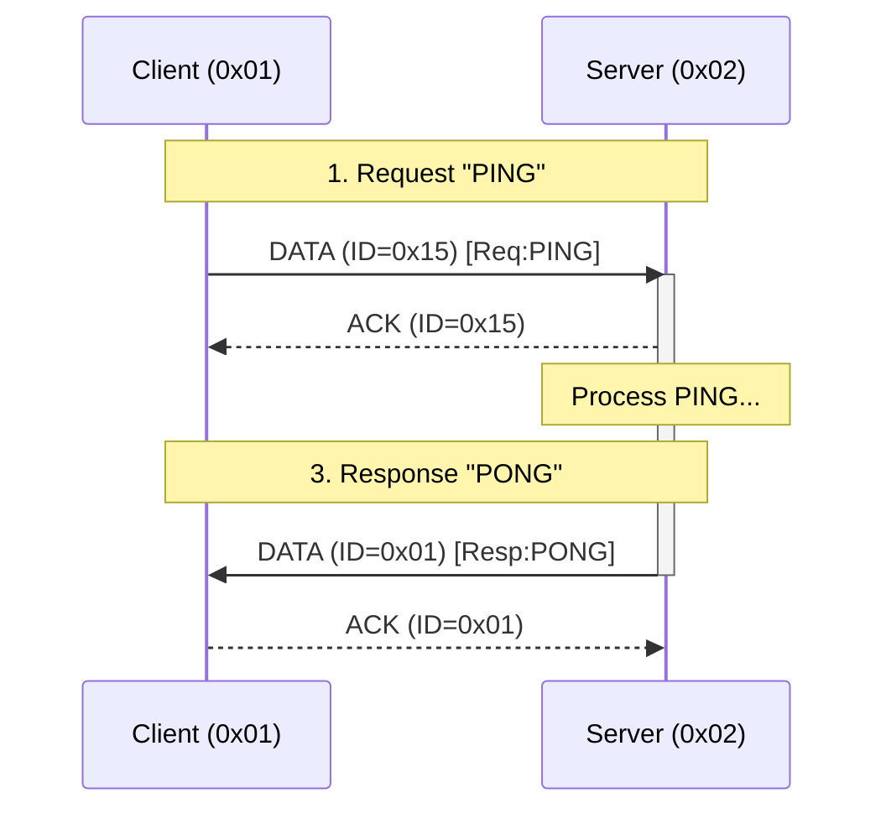

# MicroComm (microcomm) Protocol for Microcontrollers

This document defines the **microcomm** protocol, a modular, hardware-agnostic communication stack specifically optimized for resource-constrained microcontrollers. It prioritizes memory efficiency (Zero-Copy), low latency, and support for both atomic transactions and continuous data streams on embedded hardware.

## Design Philosophy & Constraints
**microcomm** is designed for **reliability and low-traffic control systems**, not high-throughput data pipes.
*   **Sequential & Exclusive**: Servers handle only one client at a time to minimize RAM usage (static allocation).
*   **Fail-Fast**: It is better to drop a session quickly than to block the channel with indefinite retries.
*   **Resource Priority**: Reliability > Memory Efficiency > Throughput.

## Modular Architecture (Pay-As-You-Go)
**microcomm** is designed as a vertical stack where each layer is independent. Developers should only implement up to the layer required for their specific use case to minimize RAM and Flash footprint.

*   **L1-L3 (Addressing Only)**: Best for simple "fire-and-forget" beacons or sensors where data loss is acceptable.
*   **L1-L5 (Reliable Datagrams)**: Best for simple remote triggers or status updates that fit in a single packet (no fragmentation).
*   **L1-L7 (Full Stack)**: Required for large data transfers (firmware, logs) or complex request/response interactions.

**Note**: If a layer is omitted, the headers for the subsequent layers are shifted up. For example, if L4 (Security) is disabled, the L5 header immediately follows the L3 header.

---

## 0. Global Configuration
The stack is customized at compile-time using the following parameters:

| Parameter | Type | Description |
| :--- | :--- | :--- |
| `PHYS_MTU` | `size_t` | The hardware packet limit (e.g., 32 for nRF24, 255 for LoRa, 1024 for Serial). |
| `ADDR_TYPE` | `type` | `uint8_t` (255 nodes) or `uint16_t` (65k nodes). |
| `L2_INTEGRITY` | `policy` | `CRC16`, `CRC32`, or `NONE` (No-Op). |
| `L4_CRYPTO` | `policy` | Custom implementation overhead (adds X bytes for IV/Tags). |
| `L5_RELIABLE` | `policy` | Defines retry limits and ACK timing. |
| `SESSION_TIMEOUT`| `ms` | Time before an inactive session is forcibly unlocked (default: 2000ms). |
| `ENDIANNESS` | `const` | **Little Endian** is mandatory for all multi-byte fields (CRC, Counters, etc.). |

## 1. Reserved Services
To facilitate discovery and network management, the following Service IDs are reserved at Layer 7:
*   `0x00`: **Discovery / Ping**. Returns device status, type, and capabilities.
*   `0xFF`: **System Reset / Bootloader**. (Optional) Triggers a remote reset.

---

## Detailed Packet Structure (On-the-Wire)

This diagram illustrates the full overhead for a **Reliable Data Packet** (L5 + L6 + L7).

```
[ L1 PHYS ... ] 
      |
      +-- [ L2 Integrity (Optional 2 bytes) ]
            |
            +-- [ L3 Addressing (2 bytes) ]
                  |
                  +-- [ L4 Security (Optional IV/Tag) ]
                        |
                        +-- [ L5 Reliability (1 byte) ]
                        |     [ Type:2 | ID:6 ]
                        |
                        +-- [ L6 Fragmentation (2 bytes) ]
                              |     [ Index:8 | Control:8 ]
                              |
                              +-- [ L7 Payload (Variable) ]
```

### Layer 7 Header Specification
To ensure interoperability, the first payload byte of **Index 0** (the first fragment) is reserved for the **L7 Header**.

*   **Structure**: `[ ServiceID: 7 bits | CMD: 1 bit ]`
    *   **CMD Bit (0)**: `REQUEST` - Client is asking for data/action.
    *   **CMD Bit (1)**: `RESPONSE` - Server is replying.
    *   **Service ID**: The target endpoint (0x00-0x7F).

### Layer 6 Stream Behavior
*   **Atomic Mode**: `Index` MUST NOT wrap. Maximum message size is `255 * Payload_Size`.
*   **Streaming Mode**: `Index` SHOULD wrap from `255` -> `0`. This allows for infinite streams (e.g., firmware updates). The receiver tracks continuity locally.

### Layer 5 Session Hygiene
*   **Packet ID Randomization**: When starting a **new** session (sending the first `Request`), the Client MUST randomize the initial `PacketID` (or increment it by a large step) to prevent the Server from mistaking it for a retry of a previous session.

---

## Payload Calculation
The maximum available data space for the developer ($P_{dev}$) per packet is:
$$P_{dev} = PHYS\_MTU - (L2_{hdr} + L3_{hdr} + L4_{ovr} + L5_{hdr} + L6_{hdr})$$

### Typical Benchmarks (32-byte MTU)
| Mode | Overhead | Available Payload |
| :--- | :--- | :--- |
| **Minimal Wired** (L1-L3) | 2 bytes | 30 bytes |
| **nRF24 Standard** (L1-L3 + L5-L6) | 5 bytes | 27 bytes |
| **Secure Wireless** (nRF24 + AES-GCM) | 21 bytes | 11 bytes |

---

## Layer 1: Physical Layer
The hardware-specific interface responsible for raw buffer transmission.
* **Requirements**: Must support sending/receiving a buffer of exactly `PHYS_MTU`.
* **Mediums**: nRF24L01, UART, LoRa, RS-485, Infrared, Laser, etc.

---

## Layer 2: Integrity Layer
Ensures data has not been corrupted during transit.
* **Standard**: Appends a Checksum (CRC16/32) to the end of the packet.
* **No-Op**: If the hardware (L1) provides guaranteed integrity, this layer is disabled to reclaim bytes.

---

## Layer 3: Addressing Layer
Provides source and destination filtering.
* **Header**: `[SourceAddress][DestinationAddress]`
* **Size**: $2 \times sizeof(ADDR\_TYPE)$
* **Broadcast**: `0xFF` or `0xFFFF` is reserved to target all nodes.

---

## Layer 4: Security Layer (Pluggable)
Provides **Confidentiality**, **Authenticity**, and **Replay Protection**.
*   **Confidentiality**: Encrypts the payload so observers cannot read command data.
*   **Replay Protection**: The cryptographic implementation **MUST** ensure freshness (e.g., using a Monotonic Counter, Timestamp, or Rolling Nonce) to reject recorded traffic.
*   **Integrity**: Prevents malicious tampering (unlike L2, which only catches noise).
*   **Warning**: Without this layer, the protocol is **Plain Text** and vulnerable to eavesdropping and command playback attacks.
*   **Context Reset**: Stateful ciphers must be re-keyed or reset on session unlock.

---

## Layer 5: Reliability Layer
Guarantees packet delivery and ensures idempotency (prevents duplicate processing).
* **Header**: 1 byte (`[Type:2bits][PacketID:6bits]`)
* **Packet Types**:
    * `00`: **DATA** - Standard payload.
    * `01`: **ACK** - Positive Acknowledgement.
    * `10`: **NACK** - Negative Acknowledgement (e.g., CRC OK, but Buffer Full / Invalid State).
    * `11`: **BUSY** - Receiver is locked by another session.
* **ACK Logic**: An `ACK` is sent immediately upon valid processing. A `NACK` is sent if the packet is technically valid (CRC matches) but cannot be accepted by the upper layers.
* **Backpressure**: The sender retries on timeout. If it receives `BUSY` or `NACK`, it may abort or wait depending on the policy.
* **Head-of-Line Blocking**: To preserve channel availability, `MAX_RETRIES` should be kept low. A failed reliable transmission should terminate the L7 session immediately.

---

## Layer 6: Fragmentation & Sequencing Layer
Handles the transport of payloads larger than the available MTU.
* **Header**: 2 bytes (`[Index:8bits][Control:8bits]`)
* **Control Bitmask**:
    * `0x01` (**IsLast**): Set if this is the final fragment of a message or stream.
    * `0x02` (**IsStream**): Set for Continuous Streaming mode (bypasses reassembly buffer).
    * `0x04-0x80`: Reserved.
* **State Hygiene**: The reassembly buffer and expected index pointers must be aggressively sanitized/zeroed whenever a session ends or times out.

---

## Layer 7: Session & Application Layer
The top-level developer interface. Manages exclusive access (Locking) and Service routing.

### Interaction Patterns

#### 1. Atomic (Request/Response)
The stack reassembles all fragments into a single buffer before notifying the application.
* **Best for**: Commands, settings, and small status updates.
* **API Pattern**: `TheStack.request(target, serviceID, payload, length)`

#### 2. Streaming (Continuous)
Fragments are passed to the developer's callback immediately upon arrival. No reassembly buffer is used.
* **Best for**: Logs, telemetry, audio, and large file transfers.
* **API Pattern**: `TheStack.openStream(target, serviceID)` -> Returns a `Stream` object.

### Discovery & Service Mapping (Service 0x00)
To eliminate the need for hardcoded node addresses, `microcomm` defines a standard handshake for dynamic discovery and logical binding.

#### 1. Broadcast Storm Mitigation
In large deployments where multiple nodes may initialize simultaneously (e.g., after a power failure), a "Broadcast Storm" can congest the physical medium.
*   **Randomized Jitter**: Nodes **SHOULD** wait for a random interval (the "Startup Jitter") before initiating discovery.
*   **Exponential Backoff**: If no server responds, the interval between subsequent discovery attempts should increase to prevent permanent channel saturation.

#### 2. The Discovery Handshake
**A. Search (Client -> Broadcast)**
The client transmits a broadcast packet to the network to identify available services.
*   **L3 Dest**: `0xFF` (or `0xFFFF`)
*   **L7 Service**: `0x00`
*   **Payload (Optional)**:
    *   **Device Type**: A 1-byte category identifier.
    *   **UID**: A 4-byte Unique Identifier (e.g., Chip ID or UUID) used for explicit pairing.

**B. Offer (Server -> Client)**
A server hearing a Search request may respond if it provides the requested service or matches the provided type/UID.
*   **L3 Dest**: Unicast to the Client's source address.
*   **L7 Service**: `0x00`
*   **Payload**:
    *   **Server Details**: Protocol version, capabilities bitmask, and server type.
    *   **Target UID**: If the Client provided a UID, the Server **MUST** echo it to confirm the offer is intended for that specific hardware.

**C. Association (Client Logic)**
Upon receiving a valid Offer, the Client performs an **Association**. 
*   The Client updates its internal routing table to map future service requests to the Server's Layer 3 address.
*   **Persistence**: Implementations may choose to persist this mapping in non-volatile storage to reduce discovery overhead on subsequent reboots, though this is not strictly required by the protocol.

---

## Security, Safety & Session Management
This protocol relies on a "Single Active Session" model to minimize RAM usage. This introduces critical safety requirements.

### Threat Model & Defenses
| Threat | Mitigation Layer | Mechanism |
| :--- | :--- | :--- |
| **Signal Noise** | **L2** (Integrity) | CRC16/32 Checksums discard corrupted bits. |
| **Eavesdropping** | **L4** (Security) | AES/Chacha encryption hides payload content. |
| **Replay Attack** | **L4** (Security) | Crypto Nonces/Counters reject old messages. |
| **Tampering** | **L4** (Security) | Auth Tags (MAC) detect malicious modification. |
| **Zombie Client** | **L7** (Session) | Watchdog Timer (Fail-Fast) unlocks the server. |
| **Packet Loss** | **L5** (Reliability)| ACKs and Retries ensure delivery. |

### Session Lifecycle Rules
1. **Handshake**: A session begins with a `SESSION_START` packet identifying the Service and Pattern.
2. **Locking**: The Server locks itself to the Client's address. Other clients receive a `BUSY` response.
3. **Watchdog (Zombie Protection)**: 
    *   Since the server ignores other clients while locked, a client crashing mid-session acts as a Denial-of-Service.
    *   The `SESSION_TIMEOUT` must be checked via interrupts or every loop cycle, not just on packet arrival.
4. **Zero-Copy**: Data is processed in-place. The application receives a pointer to the hardware buffer to avoid RAM-heavy copying.
5. **Fail-Fast**: If a timeout or retry limit is reached, the session is immediately invalidated, the lock is released, and all L4/L6 state is wiped to prepare for the next client.

---

# Appendix A: Example Transaction

**Scenario**: Client (Addr `0x01`) sends "PING" to Server (Addr `0x02`) on Service `0x00`.
**Config**: `PHYS_MTU=32`, `L2=CRC16`, `L5=Enabled`.



## 1. Request (Client -> Server)
*   **L3**: Src=`0x01`, Dst=`0x02`
*   **L5**: Type=`DATA` (00), ID=`0x15` (Random start) -> Byte `0x15`
*   **L6**: Index=`0`, Control=`IsLast` (0x01) -> Bytes `00 01`
*   **L7**: Service=`0x00`, Cmd=`REQ` (0) -> Byte `0x00`
*   **Payload**: "PING" -> `50 49 4E 47`

**Packet Hex Dump (12 bytes total):**
```
01 02       (L3 Header)
15          (L5 Header)
00 01       (L6 Header)
00          (L7 Header)
50 49 4E 47 (Payload "PING")
A1 B2       (L2 CRC16 - Example)
```

## 2. ACK (Server -> Client)
Server acknowledges the L5 packet immediately.
*   **L3**: Src=`0x02`, Dst=`0x01`
*   **L5**: Type=`ACK` (01), ID=`0x15` -> Byte `0x55` (01010101)
*   **L6/L7**: (Empty/None)

**Packet Hex Dump (5 bytes total):**
```
02 01       (L3 Header)
55          (L5 Header - ACK 0x15)
C3 D4       (L2 CRC16 - Example)
```

## 3. Response (Server -> Client)
Server application processes "PING" and returns "PONG".
*   **L3**: Src=`0x02`, Dst=`0x01`
*   **L5**: Type=`DATA` (00), ID=`0x01` (Server's own sequence start)
*   **L6**: Index=`0`, Control=`IsLast` (0x01)
*   **L7**: Service=`0x00`, Cmd=`RESP` (1) -> Byte `0x80`
*   **Payload**: "PONG" -> `50 4F 4E 47`

**Packet Hex Dump (12 bytes total):**
```
02 01       (L3 Header)
01          (L5 Header)
00 01       (L6 Header)
80          (L7 Header - RESP)
50 4F 4E 47 (Payload "PONG")
E5 F6       (L2 CRC16 - Example)
```