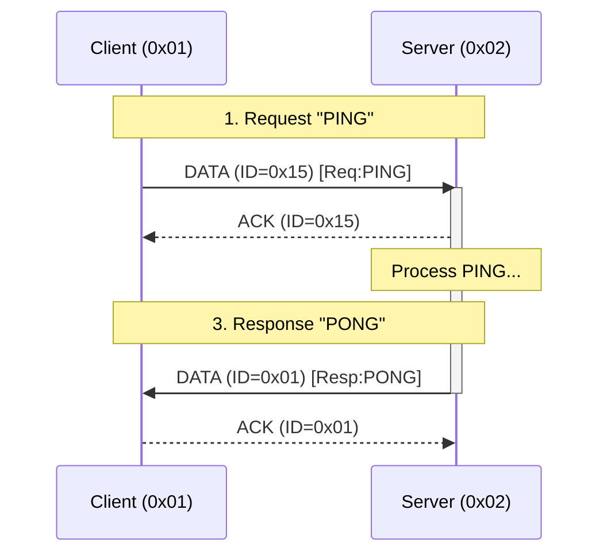

# MicroComm (microcomm) Protocol for Microcontrollers

This document defines the **microcomm** protocol, a modular, hardware-agnostic communication stack specifically optimized for resource-constrained microcontrollers. It prioritizes memory efficiency (Zero-Copy), low latency, and support for both atomic transactions and continuous data streams on embedded hardware.

## Design Philosophy & Constraints
**microcomm** is designed for **reliability and low-traffic control systems**, not high-throughput data pipes.
*   **Single-Hop (Star/P2P)**: `microcomm` is strictly a point-to-point or star-topology protocol. It does **not** support multi-hop mesh routing, keeping latency predictable and RAM overhead minimal.
*   **Fail-Fast**: Better to drop a session quickly than to block the channel indefinitely.
*   **Resource Priority**: Reliability > Memory Efficiency > Throughput.
*   **Deterministic**: Behavior must be predictable even under heavy interference or load.

## Modular Architecture (Pay-As-You-Go)
**microcomm** is designed as a vertical stack where each layer is independent. Developers should only implement up to the layer required for their specific use case to minimize RAM and Flash footprint.

*   **L1-L3 (Addressing Only)**: Best for simple "fire-and-forget" beacons or sensors where data loss is acceptable.
*   **L1-L5 (Reliable Datagrams)**: Best for simple remote triggers or status updates that fit in a single packet (no fragmentation).
*   **L1-L7 (Full Stack)**: Required for large data transfers (firmware, logs) or complex request/response interactions.

**Note**: If a layer is omitted, the headers for the subsequent layers are shifted up. For example, if L4 (Security) is disabled, the L5 header immediately follows the L3 header.

---

## 0. Global Configuration
The stack is customized at compile-time using the following parameters:

| Parameter | Type | Description |
| :--- | :--- | :--- |
| `PHYS_MTU` | `size_t` | The hardware packet limit (e.g., 32 for nRF24, 255 for LoRa, 1024 for Serial). |
| `ADDR_TYPE` | `type` | `uint8_t` (255 nodes) or `uint16_t` (65k nodes). |
| `L2_INTEGRITY` | `policy` | `CRC16`, `CRC32`, or `NONE` (No-Op). |
| `L4_CRYPTO` | `policy` | Custom implementation overhead (adds X bytes for IV/Tags). |
| `L5_RELIABLE` | `policy` | Defines retry limits and ACK timing. |
| `SESSION_TIMEOUT`| `ms` | Time before an inactive session is forcibly unlocked (default: 2000ms). |
| `ENDIANNESS` | `const` | **Little Endian** is mandatory for all multi-byte fields (CRC, Counters, etc.), including payloads for **Reserved Services** (0x00, 0x7F). The **4-byte UID** is treated as a 32-bit Little Endian integer. |

### Timeout & Retry Guidelines
To ensure responsiveness on high-latency mediums (like LoRa) while remaining snappy on fast mediums (like nRF24), use the following calculation:
*   **Base Timeout**: `(Time_to_send_MTU * 2) + Processing_Latency`.
*   **nRF24 Example**: ~10–20ms.
*   **LoRa Example**: ~500–2000ms.
*   **Serial (115200)**: ~5–10ms.
*   **Infrared (2400 baud)**: ~100–300ms.
*   **Rule**: `SESSION_TIMEOUT` should always be significantly larger than `Base_Timeout * MAX_RETRIES`.

## Detailed Packet Structure (On-the-Wire)

This diagram illustrates the full overhead for a **Reliable Data Packet** (L5 + L6 + L7).

```
[ L1 PHYS ... ] 
      |
      +-- [ L3 Addressing (2 bytes) ]
            |
            +-- [ L4 Security (Optional IV/Tag) ]
                  |
                  +-- [ L5 Reliability (1 byte) ]
                  |     [ Type:2 | ID:6 ]
                  |
                  +-- [ L6 Fragmentation (2 bytes) ]
                        |     [ Index:8 | Control:8 ]
                        |
                        +-- [ L7 Payload (Variable) ]
                              |
                              +-- [ L2 Integrity (Optional 2-byte Trailer) ]
```

### Layer 7 Header Specification
To ensure interoperability, the first payload byte of **Index 0** (the first fragment) is reserved for the **L7 Header**.

*   **Structure**: `[ CMD: 1 bit | ServiceID: 7 bits ]`
    *   **CMD Bit (0)**: `REQUEST` - Client is asking for data/action.
    *   **CMD Bit (1)**: `RESPONSE` - Server is replying.
    *   **Service ID**: The target endpoint (0x00-0x7F).

**Note**: For **Atomic Responses**, the first byte of the application payload MUST be the **Status Code** (0x00 = Success). This ensures the client can distinguish between a successful transport and a successful application command.

### Layer 6 Stream Behavior
*   **Atomic Mode**: `Index` MUST NOT wrap. Maximum message size is `255 * Payload_Size`.
*   **Streaming Mode**: `Index` SHOULD wrap from `255` -> `0`. This allows for infinite streams (e.g., firmware updates). The receiver tracks continuity locally.

### Layer 5 Session Hygiene
*   **Packet ID Randomization**: When starting a **new** session (sending the first `Request`), the Client MUST randomize the initial `PacketID` (or increment it by a large step) to prevent the Server from mistaking it for a retry of a previous session.

---

## Payload Calculation
The maximum available data space for the developer ($P_{dev}$) per packet is:
$$P_{dev} = PHYS\_MTU - (L2_{hdr} + L3_{hdr} + L4_{ovr} + L5_{hdr} + L6_{hdr})$$

### Typical Benchmarks (32-byte MTU)
| Mode | Overhead | Available Payload |
| :--- | :--- | :--- |
| **Minimal Wired** (L1-L3) | 2 bytes | 30 bytes |
| **nRF24 Standard** (L1-L3 + L5-L6) | 5 bytes | 27 bytes |
| **Secure Wireless** (nRF24 + AES-GCM) | 21 bytes | 11 bytes |

---

## Layer 1: Physical Layer
The hardware-specific interface responsible for raw buffer transmission.

*   **PHYS_MTU (Maximum Transmission Unit)**: The absolute maximum number of bytes the hardware can transmit in a single atomic burst (e.g., 32 bytes for nRF24L01, 255 for LoRa). This is the hard ceiling for the entire protocol stack.
*   **Requirements**: Must support sending/receiving a buffer of **up to** `PHYS_MTU` in size.
*   **Collision Avoidance (LBT)**: Mediums that do not provide hardware-level collision detection (like RS-485 or raw radio) **SHOULD** implement a "Listen-Before-Talk" (LBT) strategy. Nodes should verify the medium is idle for a few microseconds before transmitting.
*   **Framing (Byte-Streams)**: For mediums that do not provide implicit packet boundaries (e.g., UART, RS-485), the L1 driver **MUST** implement a framing strategy to delineate packets. Recommended methods include a `[Length]` prefix or **SLIP** (Serial Line IP) encoding.
*   **Address Mapping**: The Layer 1 driver is responsible for mapping the **Layer 3 Logical Address** to the physical medium's specific addressing scheme (e.g., nRF24 pipes, LoRa sync words, or ignoring it entirely for point-to-point Serial/UART).
*   **Mediums**: nRF24L01, UART, LoRa, RS-485, Infrared, Laser, etc.

---

## Layer 2: Integrity Layer
Ensures data has not been corrupted during transit.
* **Standard**: Appends a Checksum (CRC16/32) to the end of the packet (Trailer).
* **Polynomials**:
    * **CRC16**: `0x1021` (CCITT-FALSE).
    * **CRC32**: `0x04C11DB7` (Ethernet/MPEG-2).
* **No-Op**: If the hardware (L1) provides guaranteed integrity, this layer is disabled to reclaim bytes.

---

## Layer 3: Addressing Layer
Provides source and destination filtering.
* **Header**: `[SourceAddress][DestinationAddress]`
* **Size**: $2 \times sizeof(ADDR\_TYPE)$
* **Reserved Addresses**:
    * `0x00`: **Unassigned/Controller**. Used by new nodes during discovery or as a default gateway.
    * `0xFF` or `0xFFFF`: **Broadcast**. Targets all nodes on the network.

---

## Layer 4: Security Layer (Pluggable)
Provides **Confidentiality**, **Authenticity**, and **Replay Protection**.
*   **Confidentiality**: Encrypts the payload so observers cannot read command data.
*   **Replay Protection**: The cryptographic implementation **MUST** ensure freshness (e.g., using a Monotonic Counter, Timestamp, or Rolling Nonce) to reject recorded traffic.
*   **Integrity**: Prevents malicious tampering (unlike L2, which only catches noise).
*   **Reboot Persistence**: Cryptographic counters (Nonces) **MUST** be persisted to non-volatile memory (EEPROM/Flash) or reset through a secure out-of-band handshake. If a node reboots and resets its counter to zero, the receiver will reject all traffic as a "Replay Attack" unless a new security session is established.
*   **Warning**: Without this layer, the protocol is **Plain Text** and vulnerable to eavesdropping and command playback attacks.
*   **Context Reset**: Stateful ciphers must be re-keyed or reset on session unlock.

---

## Layer 5: Reliability Layer
Guarantees packet delivery and ensures idempotency (prevents duplicate processing).
* **Header**: 1 byte (`[Type:2bits][PacketID:6bits]`)
* **Packet Types**:
    * `00`: **DATA** - Standard payload.
    * `01`: **ACK** - Positive Acknowledgement.
    * `10`: **NACK** - Negative Acknowledgement (e.g., CRC OK, but Buffer Full / Invalid State).
    * `11`: **BUSY** - Receiver is locked by another session.
* **ACK Logic**: An `ACK` is sent immediately upon valid processing. A `NACK` is sent if the packet is technically valid (CRC matches) but cannot be accepted by the upper layers.
* **Flow Control (Stop-and-Wait)**: To support the single-buffer model of microcontrollers, `microcomm` uses a **Sequential Stop-and-Wait** mechanism. A sender **MUST NOT** transmit packet $N+1$ until it has received a valid `ACK` (or reached a timeout) for packet $N$.
* **Idempotency (Exactly-Once Processing)**: To prevent side-effects from re-transmissions (e.g., toggling a light twice), the receiver **MUST** track the last processed `PacketID` for the current session. If a duplicate `PacketID` is received, the receiver must re-send the `ACK` but **MUST NOT** pass the payload to the application layer again.
* **Randomized Backoff**: To prevent persistent collisions after a failure, retries **MUST** include a randomized jitter (e.g., `Base_Timeout + rand(0, 10ms)`).
* **Backpressure**: The sender retries on timeout. If it receives `BUSY` or `NACK`, it may abort or wait depending on the policy.
* **Head-of-Line Blocking**: To preserve channel availability, `MAX_RETRIES` should be kept low. A failed reliable transmission should terminate the L7 session immediately.
* **Broadcast Restriction**: Reliability (ACKs) **MUST NOT** be used with Broadcast destination addresses. A broadcast packet is always "fire-and-forget" to prevent a "Broadcast ACK Storm" where every node on the network transmits simultaneously.

---

## Layer 6: Fragmentation & Sequencing Layer
Handles the transport of payloads larger than the available MTU.
* **Header**: 2 bytes (`[Index:8bits][Control:8bits]`)
* **Control Bitmask**:
    * `0x01` (**IsLast**): Set if this is the final fragment of a message or stream. Receipt of this bit signals the application to close the current data buffer or stream.
    * `0x02` (**IsStream**): Set for Continuous Streaming mode (bypasses reassembly buffer).
    * `0x04-0x80`: Reserved.
* **State Hygiene**: The reassembly buffer and expected index pointers must be aggressively sanitized/zeroed whenever a session ends or times out.

---

## Layer 7: Session & Application Layer
The top-level developer interface. Manages exclusive access (Locking) and Service routing.

### Session Model & Memory Management
To survive on the smallest microcontrollers, Layer 7 enforces a strict memory and concurrency model:

*   **Single Active Session (Hardware Reality)**: Microcontrollers typically lack the RAM to manage multiple simultaneous reassembly buffers. To prevent memory exhaustion, a server **MUST** handle only one client at a time, locking itself to that source address until completion or timeout.
*   **Static Allocation (No Heap)**: For mission-critical reliability, the protocol is designed to be implemented without dynamic memory allocation (`malloc`/`new`). This prevents runtime crashes due to heap fragmentation.

### Services & Service IDs
A **Service** represents a specific logical endpoint or functional module on a device (e.g., a "Temperature Sensor" service, a "Motor Control" service, or a "System Settings" service).

The **Service ID** is a 7-bit identifier (0x00 - 0x7F) that acts as a "port number" to route incoming requests to the correct application-level handler.

#### Reserved Service IDs
To ensure interoperability, specific Service IDs are standard across the `microcomm` ecosystem:

| ID | Name | Description |
| :--- | :--- | :--- |
| `0x00` | **Discovery** | Dynamic address resolution and capabilities exchange. |
| `0x7F` | **System** | Opcodes: `0x01` (Reset), `0x02` (Bootloader), `0x03` (Time Sync - 4-byte Unix Timestamp). |
| `0x01-0x7E` | **User Defined** | Available for custom application logic. |

### Interaction Patterns

#### 1. Atomic (Request/Response)
The stack reassembles all fragments into a single buffer before notifying the application.
* **Best for**: Commands, settings, and small status updates.
* **Overflow Protection**: If a receiver detects that an incoming message will exceed its **Max Buffer Size**, it **MUST** send a `NACK` (L5) immediately to terminate the session and prevent memory corruption.
* **Status Codes**: The first byte of a **RESPONSE** payload `SHOULD` be a Status Code (e.g., `0x00` for Success, `0x01` for Invalid Command, `0x02` for Unauthorized). This allows the application to report logical errors even if the transport was successful.
* **Reliability Best Practice (State vs. Action)**: For critical controls, developers SHOULD use **State-based commands** (e.g., `SET_STATE(OPEN)`) rather than **Action-based commands** (e.g., `TOGGLE`). Combining state-based commands with **Queryable State** (`GET_STATUS`) ensures logical "Exactly-Once" behavior even across node reboots or catastrophic packet loss.
* **API Pattern**: `TheStack.request(target, serviceID, payload, length)`

#### 2. Streaming (Continuous)
A peer-to-peer pattern where data is passed to the application immediately upon arrival, bypassing the need for a large reassembly buffer.
*   **Memory Efficiency**: Crucial for memory-constrained boards; allows processing infinite data (e.g., audio/firmware) using only a single packet-sized RAM footprint.
*   **Directionality**: Any node (Client or Server) can act as the **Source** (sender) or **Sink** (receiver).
*   **Termination**:
    *   **Source-side**: The Source terminates the stream by setting the `IsLast` bit (L6) on the final fragment.
    *   **Sink-side**: The Sink may terminate the stream at any time by sending a `NACK` (L5). The Source MUST immediately stop transmitting fragments upon receipt of a `NACK` during a stream.
*   **Best for**: Logs, telemetry, audio, and large file transfers.
*   **API Pattern**: `TheStack.openStream(target, serviceID)` -> Returns a `Stream` object.

### Power Management Models
`microcomm` supports two primary models for interacting with energy-constrained devices:

1. **Server-Push (Always-On)**: The standard model where the Server listens indefinitely for requests. Lowest latency, but consumes the most power (~13mA for nRF24 RX).
2. **Client-Pull (Beaconing)**: Optimized for battery-powered nodes. The node (Server) sleeps, wakes up periodically, sends a "Ready" beacon to its Hub (Client), and listens for a short window (e.g., 20ms) for any pending commands. This allows for multi-year battery life at the cost of higher command latency.

### Discovery & Service Mapping (Service 0x00)
**The Problem**: In traditional embedded networking, destination addresses are often hardcoded into firmware (e.g., `#define HUB_ADDRESS 0x02`). This makes systems fragile: if a Hub is replaced, every sensor in the building must be re-flashed. It also prevents "off-the-shelf" deployment where a user can simply power on a new device and have it work instantly.

**The Solution**: `microcomm` provides a dynamic discovery mechanism that allows nodes to find their servers at runtime, enabling zero-configuration deployment and "hot-swappable" hardware.

#### 1. Broadcast Storm & Collision Mitigation
In large deployments where multiple nodes interact simultaneously, collisions are the primary cause of discovery failure.
*   **Startup Jitter (Clients)**: Nodes **SHOULD** wait for a random interval (the "Startup Jitter") before initiating a `SEARCH`.
*   **Response Jitter (Servers)**: Servers **MUST** wait for a small randomized interval (e.g., 10–100ms) before responding to a broadcast `SEARCH` to prevent their `OFFER` packets from colliding with other servers.
*   **Exponential Backoff**: If no server responds, the interval between subsequent discovery attempts should increase exponentially.

#### 2. The Discovery Handshake
**A. Search (Client -> Broadcast)**
*   **L3 Dest**: `0xFF` (or `0xFFFF`)
*   **L3 Src**: `0x00` (Unassigned)
*   **Payload**:
    *   **Device Type**: A 1-byte category identifier.
    *   **UID**: A 4-byte Unique Identifier.
    *   **Client MTU**: The maximum buffer size of the Client.
    *   **Required Capabilities**: A 1-byte bitmask of features the Server **MUST** support to respond:
        *   **Bit 0**: Security (L4).
        *   **Bit 1**: Streaming (L7).
        *   **Bit 2**: Fragmentation (L6).
        *   **Bit 3-7**: Reserved.

**B. Offer (Server -> Client)**
*   **L3 Dest**: Unicast to the Client's UID/temporary address.
*   **Payload**:
    *   **Assigned Address**: The Logical Address the Client **MUST** use for all future transmissions to this Server.
    *   **Protocol Version**: A 1-byte version identifier (e.g., `0x01`).
    *   **Heartbeat Interval**: A 1-byte value (in seconds) representing how often the node will send a "Keep-Alive". A value of `0` disables heartbeats.
    *   **Max Buffer Size**: The total RAM (in bytes) available for Atomic reassembly. Senders **MUST NOT** exceed this size for multi-fragment messages.
    *   **Server Capabilities**: A bitmask of supported layers and features.
    *   **MTU**: The Server's maximum buffer size. The Client **MUST** use the minimum of its own MTU and the Server's MTU for this session.
    *   **Target UID**: Echoed to confirm the recipient.

**C. Association (Client Logic)**
Upon receiving an Offer, the Client **MUST** verify that the `Target UID` in the payload matches its own hardware UID. This prevents address collisions if multiple nodes are performing discovery simultaneously.
*   Once verified, the Client updates its internal routing table to map future service requests to the Server's Layer 3 address using the **Assigned Address**.
*   **Server Lease Management**: Servers should maintain a small, fixed-size "Lease Table" (statically allocated) to map UIDs to Logical Addresses. This ensures that a rebooted node can reclaim its previously assigned address.
*   **Persistence**: Implementations may choose to persist this mapping in non-volatile storage to reduce discovery overhead on subsequent reboots, though this is not strictly required by the protocol.

#### 3. Capability Discovery (GET_SERVICES)
Once a basic association is formed, a Client may query the Server for its specific capabilities.
*   **Request**: A `DATA` packet to Service `0x00` with an empty payload or a specific "GET_SERVICES" opcode.
*   **Response**: A list of 2-byte pairs: `[ServiceID:8][ServiceType:8]`.
*   **Keep-Alive (Heartbeat)**: Nodes supporting heartbeats transmit a `DATA` packet to Service `0x00` with a 1-byte payload of `0xFE`. If the Hub (Client) fails to receive this for 2x the negotiated interval, the node is considered offline.
*   **Benefit**: Allows a Hub to automatically configure a dashboard or logic for a new device without manual setup.

---

## Security, Safety & Session Management
This protocol relies on a "Single Active Session" model to minimize RAM usage. This introduces critical safety requirements.

### Threat Model & Defenses
| Threat | Mitigation Layer | Mechanism |
| :--- | :--- | :--- |
| **Signal Noise** | **L2** (Integrity) | CRC16/32 Checksums discard corrupted bits. |
| **Eavesdropping** | **L4** (Security) | AES/Chacha encryption hides payload content. |
| **Replay Attack** | **L4** (Security) | Crypto Nonces/Counters reject old messages. |
| **Tampering** | **L4** (Security) | Auth Tags (MAC) detect malicious modification. |
| **Zombie Client** | **L7** (Session) | Watchdog Timer (Fail-Fast) unlocks the server. |
| **Packet Loss** | **L5** (Reliability)| ACKs and Retries ensure delivery. |

### Session Lifecycle Rules
1.  **Handshake (Implicit)**: A session is initiated when a Server receives a `DATA` packet with **Index 0** (L6) and the **REQUEST** bit set (L7). There is no dedicated "Handshake" packet type; the first data fragment *is* the handshake.
2.  **Locking**: Upon accepting a valid session start, the Server locks itself to the Client's Layer 3 address. Other clients attempting to connect during this window will receive a `BUSY` (L5) response.
3.  **Watchdog (Zombie Protection)**: 
    *   Since the server ignores other clients while locked, a client crashing mid-session acts as a Denial-of-Service.
    *   The `SESSION_TIMEOUT` must be checked via interrupts or every loop cycle, not just on packet arrival.
4.  **Zero-Copy**: Data is processed in-place. The application receives a pointer to the hardware buffer to avoid RAM-heavy copying.
5.  **Fail-Fast**: If a timeout or retry limit is reached, the session is immediately invalidated, the lock is released, and all L4/L6 state is wiped to prepare for the next client.

---

# Appendix A: Example Transaction

**Scenario**: Client (Addr `0x01`) sends "PING" to Server (Addr `0x02`) on Service `0x01`.
**Config**: `PHYS_MTU=32`, `L2=CRC16`, `L5=Enabled`.



## 1. Request (Client -> Server)
*   **L3**: Src=`0x01`, Dst=`0x02`
*   **L5**: Type=`DATA` (00), ID=`0x15` (Random start) -> Byte `0x15`
*   **L6**: Index=`0`, Control=`IsLast` (0x01) -> Bytes `00 01`
*   **L7**: Service=`0x01`, Cmd=`REQ` (0) -> Byte `0x01`
*   **Payload**: "PING" -> `50 49 4E 47`

**Packet Hex Dump (12 bytes total):**
```
01 02       (L3 Header)
15          (L5 Header)
00 01       (L6 Header)
01          (L7 Header)
50 49 4E 47 (Payload "PING")
A1 B2       (L2 CRC16 - Example)
```

## 2. ACK (Server -> Client)
Server acknowledges the L5 packet immediately.
*   **L3**: Src=`0x02`, Dst=`0x01`
*   **L5**: Type=`ACK` (01), ID=`0x15` -> Byte `0x55` (01010101)
*   **L6/L7**: (Empty/None)

**Packet Hex Dump (5 bytes total):**
```
02 01       (L3 Header)
55          (L5 Header - ACK 0x15)
C3 D4       (L2 CRC16 - Example)
```

## 3. Response (Server -> Client)
Server application processes "PING" and returns "PONG".
*   **L3**: Src=`0x02`, Dst=`0x01`
*   **L5**: Type=`DATA` (00), ID=`0x01` (Server's own sequence start)
*   **L6**: Index=`0`, Control=`IsLast` (0x01)
*   **L7**: Service=`0x01`, Cmd=`RESP` (1) -> Byte `0x81`
*   **Payload**: `0x00` (Status: OK) + "PONG" -> `00 50 4F 4E 47`

**Packet Hex Dump (13 bytes total):**
```
02 01          (L3 Header)
01             (L5 Header)
00 01          (L6 Header)
81             (L7 Header - RESP)
00 50 4F 4E 47 (Status OK + Payload "PONG")
E5 F6          (L2 CRC16 - Example)
```