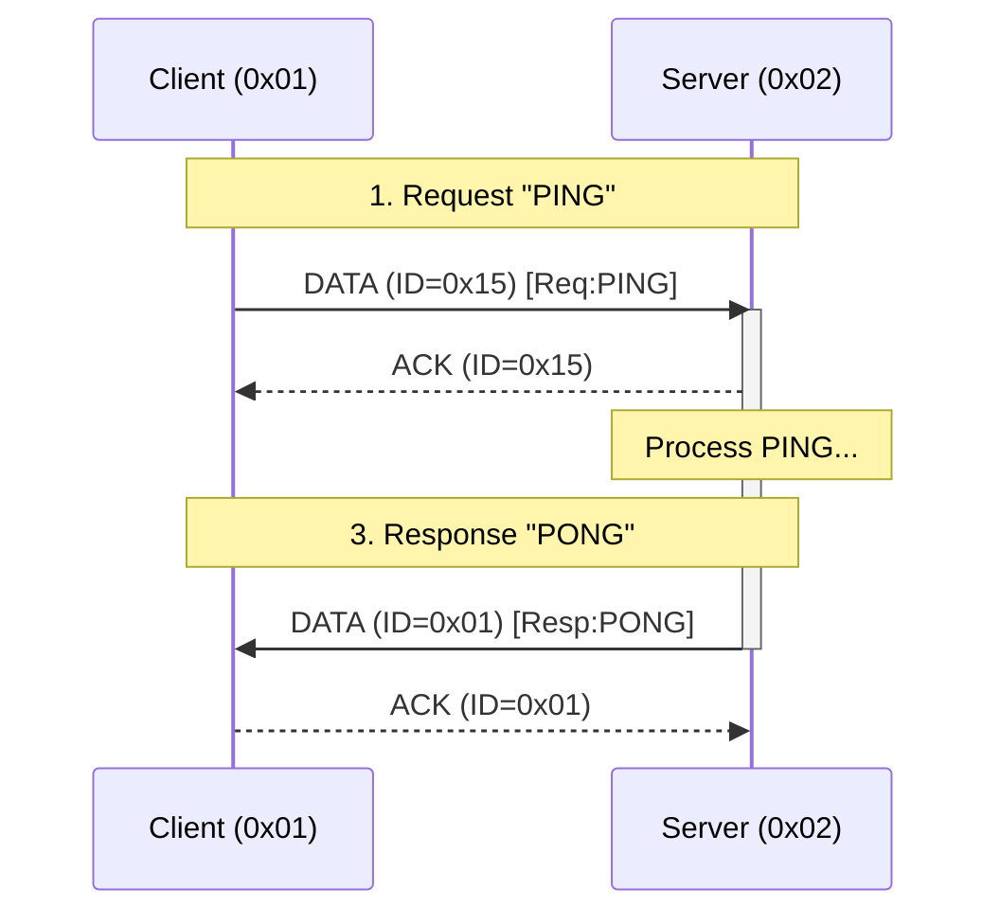

# MicroComm (microcomm) Protocol for Microcontrollers

This document defines the **microcomm** protocol, a modular, hardware-agnostic communication stack specifically optimized for resource-constrained microcontrollers. It prioritizes memory efficiency (Zero-Copy), low latency, and support for both atomic transactions and continuous data streams on embedded hardware.

## Design Philosophy & Constraints
**microcomm** is designed for **reliability and low-traffic control systems**, not high-throughput data pipes.
*   **Single-Hop (Star/P2P)**: `microcomm` is strictly a point-to-point or star-topology protocol. It does **not** support multi-hop mesh routing, keeping latency predictable and RAM overhead minimal.
*   **Fail-Fast**: Better to drop a session quickly than to block the channel indefinitely.
*   **Resource Priority**: Reliability > Memory Efficiency > Throughput.
*   **Deterministic**: Behavior must be predictable even under heavy interference or load.
*   **Byte Ordering**: All multi-byte fields (UIDs, Timestamps, CRCs, L6 Indices) **MUST** be transmitted in **Little-Endian** format.
*   **Minimum MTU**: To ensure a viable payload after headers, the physical medium (L1) **SHOULD** provide a `PHYS_MTU` of at least **10 bytes**.

## Modular Architecture (The Solid Pipe)
**microcomm** is designed as a fixed vertical stack. Every packet logically traverses all layers (`L1 → L8`). To maintain efficiency, layers can be **Transparent (Pass-Through)**, meaning they add zero bytes of overhead to the wire and perform no logic in software for that specific packet.

*   **L1-L3 (Addressing)**: Mandatory for all networked communication.
*   **L4 (Security)**: Transparent if encryption is disabled.
*   **L5-L6 (Transport)**: Manages reliability and fragmentation. L6 is transparent for single-packet messages.
*   **L7 (Session)**: Manages exclusive access (Locking) and Interaction Patterns. Transparent for stateless commands.
*   **L8 (Application)**: The final routing destination (ServiceID).

---

## Detailed Packet Structure (On-the-Wire)

This diagram illustrates the full overhead for a **Reliable Session Packet** (L1-L8).

```
[ L1 PHYS ... ] 
      |
      +-- [ L3 Addressing (2 bytes) ]
            |
            +-- [ L4 Security (Optional IV/Tag Wrapper) ]
                  |
                  +-- [ L5 Reliability (1 byte) ]
                  |     [ Type:2 | ID:6 ]
                  |
                  +-- [ L6 Fragmentation (Optional 2 bytes) ]
                  |     [ Index:8 | Control:8 ]
                  |
                  +-- [ L7 Session (Optional 1 byte) ]
                  |     [ Pattern:2 | CMD:1 | Status:5 ]
                  |
                  +-- [ L8 Application (1 byte) ]
                        |     [ ServiceID:7 | IsStateful:1 ]
                        |
                        +-- [ L7/L8 Payload (Variable) ]
                              |
                              +-- [ L2 Integrity (Optional 2-byte Trailer) ]
```

### Layer 8/7 Header Logic (Wire Efficiency)
To save bytes, Layer 7 (Session) and Layer 8 (Application) share a signaling bit. 
*   **L8 Byte**: `[ ServiceID: 7 bits | IsStateful: 1 bit ]`
*   **If IsStateful = 0**: Layer 7 is **Transparent**. The payload follows immediately.
*   **If IsStateful = 1**: Layer 7 is **Active**. The next byte is the L7 Header.

### Layer 6 Stream Behavior
*   **Atomic Mode**: `Index` MUST NOT wrap. Maximum message size is `255 * Payload_Size`.
*   **Streaming Mode**: `Index` SHOULD wrap from `255` -> `0`. This allows for infinite streams (e.g., firmware updates). The receiver tracks continuity locally.

### Layer 5 Session Hygiene
*   **Packet ID Randomization**: When starting a **new** session (sending the first `Request`), the Client MUST randomize the initial `PacketID` (or increment it by a large step) to prevent the Server from mistaking it for a retry of a previous session.

---

## Payload Calculation
The maximum available data space for the developer ($P_{dev}$) per packet is:
$$P_{dev} = PHYS\_MTU - (L2_{hdr} + L3_{hdr} + L4_{ovr} + L5_{hdr} + L6_{hdr})$$

### Typical Benchmarks (32-byte MTU)
| Mode | Overhead | Available Payload |
| :--- | :--- | :--- |
| **Minimal Wired** (L1-L3) | 2 bytes | 30 bytes |
| **nRF24 Standard** (L1-L3 + L5-L6) | 5 bytes | 27 bytes |
| **Secure Wireless** (nRF24 + AES-GCM) | 21 bytes | 11 bytes |

---

## Layer 1: Physical Layer
The hardware-specific interface responsible for raw buffer transmission.

*   **PHYS_MTU (Maximum Transmission Unit)**: The absolute maximum number of bytes the hardware can transmit in a single atomic burst (e.g., 32 bytes for nRF24L01, 255 for LoRa). This is the hard ceiling for the entire protocol stack.
*   **Requirements**: Must support sending/receiving a buffer of **up to** `PHYS_MTU` in size.
*   **Collision Avoidance (LBT)**: Mediums that do not provide hardware-level collision detection (like RS-485 or raw radio) **SHOULD** implement a "Listen-Before-Talk" (LBT) strategy. Nodes should verify the medium is idle for a few microseconds before transmitting.
*   **Framing (Byte-Streams)**: For mediums that do not provide implicit packet boundaries (e.g., UART, RS-485), the L1 driver **MUST** implement a framing strategy. 
*   **Sync Word**: It is highly recommended to prefix every packet with a 2-byte sequence `0xAA 0x55`.

---

## Layer 2: Integrity Layer
Ensures data has not been corrupted during transit.
* **Standard**: Appends a Checksum (CRC16/32) to the end of the packet (Trailer).
* **Polynomials**:
    * **CRC16**: `0x1021` (CCITT-FALSE).
    * **CRC32**: `0x04C11DB7` (Ethernet/MPEG-2).
* **No-Op**: If the hardware (L1) provides guaranteed integrity, this layer is disabled to reclaim bytes.

---

## Layer 3: Addressing Layer
Provides source and destination filtering.
* **Header**: `[SourceAddress][DestinationAddress]`
* **Address Size**: Project-wide constant (typically 1 or 2 bytes). 
* **Endianness**: If address size is > 1 byte, addresses **MUST** be transmitted in **Little-Endian** format.
* **Reserved Addresses**:
    * `0x00`: **Unassigned/Controller**.
    * `0xFF` / `0xFFFF`: **Broadcast**. Targets all nodes.

---

## Layer 4: Security Layer (Pluggable)
Provides **Confidentiality**, **Authenticity**, and **Replay Protection**.
*   **Wrapper Model**: Layer 4 acts as a secure container for the upper stack. It **MUST** encrypt the entirety of the L5, L6, and L7 headers and payloads. This ensures that metadata (like Service IDs or Packet IDs) is hidden from eavesdroppers.
*   **Confidentiality**: Encrypts the payload so observers cannot read command data.
*   **Replay Protection**: The cryptographic implementation **MUST** ensure freshness (e.g., using a Monotonic Counter, Timestamp, or Rolling Nonce) to reject recorded traffic.
*   **Integrity**: Prevents malicious tampering (unlike L2, which only catches noise).
*   **Reboot Persistence**: Cryptographic counters (Nonces) **MUST** be persisted to non-volatile memory (EEPROM/Flash) or reset through a secure out-of-band handshake. If a node reboots and resets its counter to zero, the receiver will reject all traffic as a "Replay Attack" unless a new security session is established.
*   **Warning**: Without this layer, the protocol is **Plain Text** and vulnerable to eavesdropping and command playback attacks.
*   **Context Reset**: Stateful ciphers must be re-keyed or reset on session unlock.

---

## Layer 5: Reliability Layer
Guarantees packet delivery and ensures idempotency (prevents duplicate processing).
* **Header**: 1 byte (`[Type:2bits][PacketID:6bits]`)
* **Packet Types**:
    * `00`: **DATA** - Standard payload.
    * `01`: **ACK** - Positive Acknowledgement.
    * `10`: **NACK** - Negative Acknowledgement.
    * `11`: **BUSY** - Receiver is locked or buffer is currently being processed.

**Flow Control (Stream Pause)**: During a **Streaming** interaction (L7), if a receiver is temporarily unable to accept the next fragment (e.g., waiting for a Flash page write), it `SHOULD` respond with `BUSY`. The sender MUST then wait for its retry interval and re-send the **same** fragment. This acts as a simple backpressure mechanism.
    
    **NACK Reason Codes**: When sending a `NACK`, the receiver `SHOULD` include a 1-byte reason code in the payload:
    *   `0x01`: **Buffer Overflow** (Message too large for Max Buffer Size).
    *   `0x02`: **Security Fault** (Invalid Authentication Tag or Replay detected).
*   `0x03`: **Service Missing** (Target ServiceID is not registered).
*   `0x04`: **State Error** (e.g., sending a fragment before a session is open).

**Sequence Wrapping**: PacketIDs are 6-bit circular values. Receivers MUST handle wrapping (63 -> 0) using modulo logic to ensure accurate duplicate detection.

---

## Layer 6: Fragmentation & Sequencing Layer
Handles the transport of payloads larger than the available MTU.
* **Header**: 2 bytes (`[Index:8bits][Control:8bits]`)
* **Control Bitmask**:
    * `0x01` (**IsLast**): Set if this is the final fragment of a message or stream. Receipt of this bit signals the application to close the current data buffer or stream.
    * `0x02` (**IsStream**): Set for Continuous Streaming mode (bypasses reassembly buffer).
    * `0x04-0x80`: Reserved.
* **State Hygiene**: The reassembly buffer and expected index pointers must be aggressively sanitized/zeroed whenever a session ends or times out.

---

## Layer 7: Session Layer
The management layer responsible for the lifecycle of a conversation. It is **Transparent** unless the `IsStateful` bit in L8 is set.

### Session Control Header
When active, the L7 header (1 byte) follows the L8 header:
*   **Pattern (2 bits)**:
    *   `00`: **None** (Stateless/Datagram).
    *   `01`: **Atomic** (Reassemble full message before notify).
    *   `10`: **Stream** (Pass fragments to app immediately).
*   **CMD (1 bit)**: `0` for REQUEST, `1` for RESPONSE.
*   **Status/Reserved (5 bits)**: Reserved for future control signals or internal session status.

### Session Model & Memory Management
*   **Single Active Session**: To prevent memory exhaustion, a server **MUST** handle only one stateful client at a time, locking itself to that source address until completion or timeout.
*   **Static Allocation**: The layer must be implementable without `malloc`, using a fixed-size session state block.

---

## Layer 8: Application Layer
The final destination. Responsible for routing data to the correct functional handler.

*   **Header (1 byte)**: `[ ServiceID: 7 bits | IsStateful: 1 bit ]`
*   **ServiceID**: Target endpoint (0x00 - 0x7F).
*   **IsStateful**: If `1`, the next byte is the **Layer 7 Session Header**.

### Interaction Patterns

#### 1. Atomic (Request/Response)
The stack reassembles all fragments into a single buffer before notifying the application.
*   **Best for**: Commands, settings, and small status updates.
*   **Overflow Protection**: If a receiver detects that an incoming message will exceed its **Max Buffer Size**, it **MUST** send a `NACK` (L5) immediately to terminate the session and prevent memory corruption.
*   **Status Codes**: The first byte of an Atomic **RESPONSE** payload `SHOULD` be a Status Code:
    *   `0x00`: **SUCCESS** - Operation completed normally.
    *   `0x01`: **FAILURE** - Generic application error.
    *   `0x02`: **INVALID_DATA** - Payload format or arguments were incorrect.
    *   `0x03`: **DENIED** - Security/Permissions error at the application level.
    *   `0x04`: **NOT_READY** - The service is busy or initializing.
*   **API Pattern**: `TheStack.request(target, serviceID, payload, length)`

#### 2. Streaming (Continuous)
A peer-to-peer pattern where data is passed to the application immediately upon arrival, bypassing the need for a large reassembly buffer.
*   **Memory Efficiency**: Allows processing infinite data using only a single packet-sized RAM footprint.
*   **Directionality**: Any node can act as the **Source** (sender) or **Sink** (receiver).
*   **Termination**:
    *   **Source-side**: Setting the `IsLast` bit (L6) on the final fragment.
    *   **Sink-side**: Sending a `NACK` (L5) to force the Source to stop.
*   **API Pattern**: `TheStack.openStream(target, serviceID)`

### Reserved Service IDs
To ensure interoperability, specific Service IDs are standard across the `microcomm` ecosystem:

| ID | Name | Description |
| :--- | :--- | :--- |
| `0x00` | **Discovery** | Dynamic address resolution and capabilities exchange. |
| `0x7F` | **System** | Opcodes: `0x01` (Reset), `0x02` (Bootloader), `0x03` (Time Sync - 4-byte Unix Timestamp). |
| `0x01-0x7E` | **User Defined** | Available for custom application logic. |

### Reliability Best Practice (State vs. Action)
For critical controls, developers SHOULD use **State-based commands** (e.g., `SET_STATE(OPEN)`) rather than **Action-based commands** (e.g., `TOGGLE`). Combining state-based commands with **Queryable State** (`GET_STATUS`) ensures logical "Exactly-Once" behavior even across node reboots or catastrophic packet loss.

---

### Discovery & Service Mapping (Service 0x00)
**The Problem**: In traditional embedded networking, destination addresses are often hardcoded into firmware (e.g., `#define HUB_ADDRESS 0x02`). This makes systems fragile: if a Hub is replaced, every sensor in the building must be re-flashed. It also prevents "off-the-shelf" deployment where a user can simply power on a new device and have it work instantly.

**The Solution**: `microcomm` provides a dynamic discovery mechanism that allows nodes to find their servers at runtime, enabling zero-configuration deployment and "hot-swappable" hardware.

#### 1. Broadcast Storm & Collision Mitigation
In large deployments where multiple nodes interact simultaneously, collisions are the primary cause of discovery failure.
*   **Startup Jitter (Clients)**: Nodes **SHOULD** wait for a random interval (the "Startup Jitter") before initiating a `SEARCH`.
*   **Response Jitter (Servers)**: Servers **MUST** wait for a small randomized interval (e.g., 10–100ms) before responding to a broadcast `SEARCH` to prevent their `OFFER` packets from colliding with other servers.
*   **Exponential Backoff**: If no server responds, the interval between subsequent discovery attempts should increase exponentially.

#### 2. The Discovery Handshake
**A. Search (Client -> Broadcast)**
*   **L3 Dest**: `0xFF` (or `0xFFFF`)
*   **L3 Src**: `0x00` (Unassigned)
*   **Payload**:
    *   **Opcode**: `0x01` (SEARCH).
    *   **Protocol Version**: 1-byte version identifier.
    *   **Device Type**: A 1-byte category identifier.
    *   **UID**: A 4-byte Unique Identifier. `Note: It is recommended to use the MCU's internal Silicon ID or a random value generated once at first-boot and stored in EEPROM.`
    *   **Client MTU**: The maximum buffer size of the Client.
    *   **Required Capabilities**: A 1-byte bitmask of features the Server **MUST** support to respond:
        *   **Bit 0**: Security (L4).
        *   **Bit 1**: Streaming (L7).
        *   **Bit 2**: Fragmentation (L6).
        *   **Bit 3-7**: Reserved.

**B. Offer (Server -> Client)**
*   **L3 Dest**: `0x00` (Unassigned).
*   **Reliability**: The `OFFER` **MUST NOT** use Layer 5 Reliability (ACKs). If the Client fails to receive the offer, it will retry the `SEARCH` via its backoff timer.
*   **Security**: Discovery packets **SHOULD** be transmitted in **Plaintext** (L4 disabled) to allow new nodes to join before a security session is established.
*   **Payload**:
    *   **Opcode**: `0x02` (OFFER).
    *   **Assigned Address**: The Logical Address the Client **MUST** use.
    *   **Protocol Version**: A 1-byte version identifier (e.g., `0x01`).
    *   **Heartbeat Interval**: A 1-byte value (in seconds) representing how often the node will send a "Keep-Alive". A value of `0` disables heartbeats.
    *   **Max Buffer Size**: The total RAM (in bytes) available for Atomic reassembly. Senders **MUST NOT** exceed this size for multi-fragment messages.
    *   **Server Capabilities**: A bitmask of supported layers and features (Same bit mapping as Required Capabilities).
    *   **MTU**: The Server's maximum buffer size. The Client **MUST** use the minimum of its own MTU and the Server's MTU for this session.
    *   **Target UID**: Echoed to confirm the recipient.

**C. Association (Client Logic)**
Upon receiving an Offer, the Client **MUST** verify that the `Target UID` in the payload matches its own hardware UID. This prevents address collisions if multiple nodes are performing discovery simultaneously.
*   Once verified, the Client updates its internal routing table to map future service requests to the Server's Layer 3 address using the **Assigned Address**.
*   **Server Lease Management**: Servers should maintain a small, fixed-size "Lease Table" (statically allocated) to map UIDs to Logical Addresses. This ensures that a rebooted node can reclaim its previously assigned address.
*   **Persistence**: Implementations may choose to persist this mapping in non-volatile storage to reduce discovery overhead on subsequent reboots, though this is not strictly required by the protocol.

#### 3. Capability Discovery (GET_SERVICES)
Once a basic association is formed, a Client may query the Server for its specific capabilities.
*   **Request**: A `DATA` packet to Service `0x00` with payload `[Opcode:0x03]`.
*   **Response**: A `DATA` packet with payload `[Opcode:0x04][Count:N][ServiceID_1][ServiceType_1]...`.
*   **Standard Service Types**:
    *   `0x01`: **Sensor** (Read-only data).
    *   `0x02`: **Actuator** (Writeable state/control).
    *   `0x03`: **Complex** (Stream-based data like Audio/Logs).
    *   `0x04`: **Security** (Key exchange/Auth).
    *   `0x7F`: **Internal** (System/Diagnostic).
*   **Keep-Alive (Heartbeat)**: Nodes supporting heartbeats transmit a `DATA` packet to Service `0x00` with a 1-byte payload of `0xFE`. If the Hub (Client) fails to receive this for 2x the negotiated interval, the node is considered offline.
*   **Benefit**: Allows a Hub to automatically configure a dashboard or logic for a new device without manual setup.

---

### Power Management Models
`microcomm` supports two primary models for interacting with energy-constrained devices:

1. **Server-Push (Always-On)**: The standard model where the Server listens indefinitely for requests. Lowest latency, but consumes the most power.
2. **Client-Pull (Beaconing)**: Optimized for battery-powered nodes. The node (Server) sleeps, wakes up periodically, and sends a **"Ready" Beacon** to its Hub (Client).
    *   **Implementation**: The Beacon is a `DATA` packet sent to Service `0x00` with the **HEARTBEAT (0xFE)** opcode.
    *   **Listen Window**: After sending the beacon, the node listens for a short window (e.g., 20ms) for any pending `REQUEST` before returning to sleep. This allows for multi-year battery life at the cost of higher command latency.

---

## Security, Safety & Session Management
This protocol relies on a "Single Active Session" model to minimize RAM usage. This introduces critical safety requirements.

### Threat Model & Defenses
| Threat | Mitigation Layer | Mechanism |
| :--- | :--- | :--- |
| **Signal Noise** | **L2** (Integrity) | CRC16/32 Checksums discard corrupted bits. |
| **Eavesdropping** | **L4** (Security) | AES/Chacha encryption hides payload content. |
| **Replay Attack** | **L4** (Security) | Crypto Nonces/Counters reject old messages. |
| **Tampering** | **L4** (Security) | Auth Tags (MAC) detect malicious modification. |
| **Zombie Client** | **L7** (Session) | Watchdog Timer (Fail-Fast) unlocks the server. |
| **Packet Loss** | **L5** (Reliability)| ACKs and Retries ensure delivery. |

### Session Lifecycle Rules
1.  **Handshake (Implicit)**: A session is initiated when a Server receives a packet with the **IsStateful** bit set (L8) and the **REQUEST** bit set in the subsequent L7 header.
2.  **Locking**: Upon accepting a valid stateful session, the Server locks itself to the Client's Layer 3 address. Other clients attempting to connect during this window will receive a `BUSY` (L5) response.
3.  **Watchdog (Zombie Protection)**: 
    *   Since the server ignores other clients while locked, a client crashing mid-session acts as a Denial-of-Service.
    *   The `SESSION_TIMEOUT` must be checked via interrupts or every loop cycle, not just on packet arrival.
4.  **Zero-Copy**: Data is processed in-place. The application receives a pointer to the hardware buffer to avoid RAM-heavy copying.
5.  **Fail-Fast**: If a timeout or retry limit is reached, the session is immediately invalidated, the lock is released, and all L4/L6 state is wiped to prepare for the next client.

---

# Appendix A: Example Transaction

**Scenario**: Client (Addr `0x01`) sends "PING" to Server (Addr `0x02`) on Service `0x01`.
**Config**: `PHYS_MTU=32`, `L2=CRC16`, `L5=Enabled`.



## 1. Request (Client -> Server)
*   **L3**: Src=`0x01`, Dst=`0x02`
*   **L5**: Type=`DATA` (00), ID=`0x15` (Random start) -> Byte `0x15`
*   **L6**: Index=`0`, Control=`IsLast` (0x01) -> Bytes `00 01`
*   **L8**: Service=`0x01`, Stateful=`0` -> Byte `0x02` (00000010)
*   **Payload**: "PING" -> `50 49 4E 47`

**Packet Hex Dump (12 bytes total):**
```
01 02       (L3 Header)
15          (L5 Header)
00 01       (L6 Header)
02          (L8 Header - Stateless)
50 49 4E 47 (Payload "PING")
A1 B2       (L2 CRC16 - Example)
```

## 2. ACK (Server -> Client)
Server acknowledges the L5 packet immediately.
*   **L3**: Src=`0x02`, Dst=`0x01`
*   **L5**: Type=`ACK` (01), ID=`0x15` -> Byte `0x55` (01010101)
*   **L6/L8**: (Transparent/None)

**Packet Hex Dump (5 bytes total):**
```
02 01       (L3 Header)
55          (L5 Header - ACK 0x15)
C3 D4       (L2 CRC16 - Example)
```

## 3. Response (Server -> Client)
Server application processes "PING" and returns "PONG".
*   **L3**: Src=`0x02`, Dst=`0x01`
*   **L5**: Type=`DATA` (00), ID=`0x01` (Server's own sequence start)
*   **L6**: Index=`0`, Control=`IsLast` (0x01)
*   **L8**: Service=`0x01`, Stateful=`0` -> Byte `0x02`
*   **Payload**: `0x00` (Status: OK) + "PONG" -> `00 50 4F 4E 47`

**Packet Hex Dump (13 bytes total):**
```
02 01          (L3 Header)
01             (L5 Header)
00 01          (L6 Header)
02             (L8 Header - Stateless)
00 50 4F 4E 47 (Status OK + Payload "PONG")
E5 F6          (L2 CRC16 - Example)
```